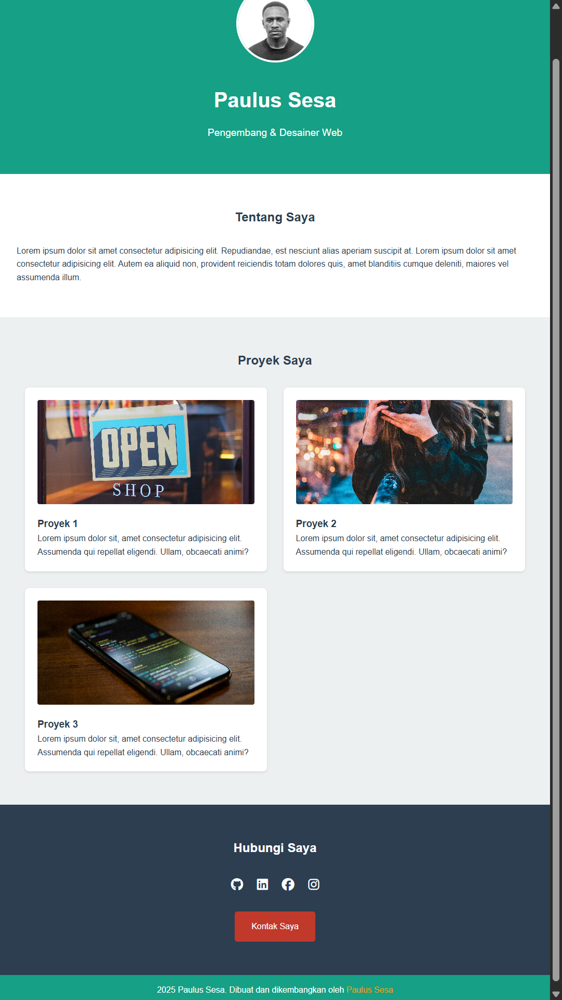

# tutorial-mr-janzen-04-2025
Belajar Coding Dasar - Membuat Personal Web Sederhana (Gunakan HTML, CSS dan Font Awesome)

## Gambar 

## Link
Kunjungi website saya:  
[Klik di sini](https://seanpaulsesa.github.io/tutorial-mr-janzen-04-2025/)

